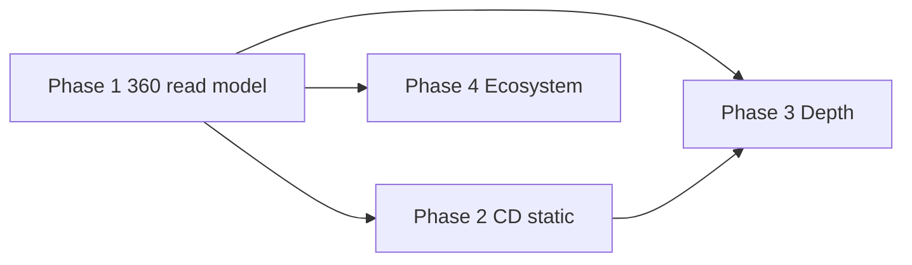

# CodeMind 360° Knowledge Graph — Phases & Tasks

**Vision:** One project = one product. Ingest **source** (application), **test**, and **cd** repos → unified graph + product intelligence → answer structural, testing, and delivery questions with evidence.

**Update model:** Manual **re-ingest** and **Refresh understanding** (no realtime git hooks, no CI/CD pipeline integrations).

**North-star metric:** A new engineer (or PM) can open a project and get an honest 360° view in &lt; 15 minutes after indexing the three slots.

---

## Out of scope (explicit)

| Not building | Alternative in product |
|--------------|------------------------|
| Realtime git (webhooks, post-commit hooks, branch sync) | User triggers re-ingest / synthesize |
| CI pipeline integration (GitHub Actions **runs**, deploy events, PR bots) | Index workflow YAML as **files** in `cd` repo only |
| Merge gates / PR comment bots | Manual blast-radius paste (Phase 1) |

**In scope for delivery plane:** static infra **and** live cluster inventory (see Phase 2).

---

## Current foundation (already in repo)

| Area | Status |
|------|--------|
| Multi-repo project (source / test / cd) | ✅ |
| Graph ingest (AST + optional LLM) | ✅ |
| PKB synthesis, product map, briefing | ✅ |
| Functional coverage (structural) | ✅ |
| Per-graph: health, security, architect, search | ✅ |
| Project Q&A + personas | ✅ (trust layer in progress) |
| Manual blast-radius (file list) | ✅ partial |
| Cross-repo linking | ⚠️ label match only |
| CD in project | ⚠️ `cd` slot + separate `/infra` API |

---

## Phase 1 — Trustworthy 360 read model

**Goal:** Three repos → one honest product picture. Dashboard **surfaces** intelligence.

**Duration (indicative):** 8–12 weeks

### 1.1 Role & project model

| ID | Task | Notes |
|----|------|--------|
| 1.1.1 | **Source** as sole application slot (legacy `ci` → source) | Verify UI + API |
| 1.1.2 | Align `GET /projects/{id}/coverage` with `application_graphs()` + `coverage_test_graphs()` | Same as synthesis |
| 1.1.3 | Project completeness: source required, test/cd optional | Summary + onboarding |

### 1.2 Cross-graph linking v2

| ID | Task | Notes |
|----|------|--------|
| 1.2.1 | Path-aware test → source links | Beyond symbol names |
| 1.2.2 | Module / package alignment (`pyproject`, `go.mod`, shared roots) | Fewer false negatives |
| 1.2.3 | Store cross-links in PKB (`coverage_links[]`) | Q&A + UI |
| 1.2.4 | Confidence per link (high / medium / low) | Surface in UI |

### 1.3 Q&A / PKB trust layer

| ID | Task | Notes |
|----|------|--------|
| 1.3.1 | Inject `module_briefs`, hub findings, `decisions[]` into ask context | `project_query.py` |
| 1.3.2 | Hub-seeded BFS for blast-radius / architecture intents | `graph_context.py` |
| 1.3.3 | `retrieval_quality` + low-confidence UX | API + answer card |
| 1.3.4 | Fix Related panel (word-boundary, filter noise labels) | `product_ontology.py` |
| 1.3.5 | Eval set for grounded answers (no invented call chains) | Quality gate |

### 1.4 Product intelligence (PKB)

| ID | Task | Notes |
|----|------|--------|
| 1.4.1 | Capabilities tested/untested from cross-links | Synthesis |
| 1.4.2 | Findings: coverage_gap, hub, coupling | Extend register |
| 1.4.3 | `# WHY` / `# DECISION` / `# TRADEOFF` → `decisions[]` | API + project UI section |
| 1.4.4 | Scenario packs wired to real PKB data | ship_safely, onboard, security |

### 1.5 Dead code & health

| ID | Task | Notes |
|----|------|--------|
| 1.5.1 | Tiered dead code API (`safe_to_remove` / `review_first`) | `classify_dead_code` |
| 1.5.2 | Health UI: tier + confidence | Repository health page |
| 1.5.3 | Optional: dead-code count on project briefing | Metric |

### 1.6 Structural change impact (manual)

| ID | Task | Notes |
|----|------|--------|
| 1.6.1 | `POST /projects/{id}/blast-radius` — user pastes changed paths | No git required |
| 1.6.2 | PR risk page + project nav link | Frontend |
| 1.6.3 | Hub findings in blast-radius response | Cross-signal |

### 1.7 Project 360 API + UI

| ID | Task | Notes |
|----|------|--------|
| 1.7.1 | `GET /projects/{id}/view` — briefing, coverage, slots, top findings | Single payload |
| 1.7.2 | Project home: repos → understanding → decisions → DNA → Q&A → coverage | Subnav |
| 1.7.3 | Single Q&A entry (`/investigate`) | Remove duplicates |
| 1.7.4 | Show `understanding_updated_at` + per-slot ingest status | Manual refresh cues |

### Phase 1 exit criteria

- [ ] Source + test + optional cd indexed; coverage % documented and correct
- [ ] Ask on blast radius / untested entries is grounded with confidence
- [ ] Manual blast-radius works for pasted file paths
- [ ] Frontend build green; no conflict markers

---

## Phase 2 — CD & infra plane (static configs + live cluster)

**Goal:** Delivery is first-class in the 360° model via (1) **static** infra in the `cd` repo and (2) **live cluster** snapshots—without CI pipeline hooks or realtime git.

| Layer | What it is | Refresh model |
|-------|------------|----------------|
| **Static** | Terraform, Helm, K8s manifests, workflow YAML on disk | Re-ingest `cd` repo |
| **Live cluster** | Read-only inventory from kube API (namespaces, workloads, services, ingress) | User clicks “Refresh cluster snapshot” |

**Duration:** 6–8 weeks

### 2.1 Unify CD with project PKB

| ID | Task | Notes |
|----|------|--------|
| 2.1.1 | `cd` graph feeds project synthesis (not orphan `/infra` only) | Same project PKB |
| 2.1.2 | Static entities: modules, resources, charts, env blocks | From file ingest |
| 2.1.3 | CD / infra findings in product map | coupling, drift hints, hub services |
| 2.1.4 | Provenance on nodes: `source=static_file` vs `source=cluster_snapshot` | For UI labels |

### 2.2 Live cluster inventory

| ID | Task | Notes |
|----|------|--------|
| 2.2.1 | `POST /projects/{id}/cluster/snapshot` — kubeconfig or in-cluster SA | On-demand only |
| 2.2.2 | Normalize to graph nodes: Deployment, Service, Ingress, ConfigMap refs | Read-only list/get |
| 2.2.3 | Store snapshot metadata: cluster name, context, captured_at | Freshness banner |
| 2.2.4 | Merge snapshot graph with static `cd` graph (or overlay layer) | Single cd view |
| 2.2.5 | Drift findings: declared in Git vs running in cluster | Compare static ↔ live |
| 2.2.6 | Optional: ECS / cloud resource snapshot (later) | Same pattern as K8s |

### 2.3 Cross-links (source ↔ cd ↔ cluster)

| ID | Task | Notes |
|----|------|--------|
| 2.3.1 | Name-based links: service / image / chart ↔ app modules | Heuristics |
| 2.3.2 | Cluster workload labels/selectors ↔ app entry points | label/selector match |
| 2.3.3 | Store `deploy_links[]` in PKB with confidence | Q&A context |
| 2.3.4 | Finding types: “running but untested”, “declared but not deployed” | Static vs live |

### 2.4 CD & cluster in UI

| ID | Task | Notes |
|----|------|--------|
| 2.4.1 | Project 360: **Delivery** section (static + last cluster snapshot) | Not pipeline runs |
| 2.4.2 | CD repository tab: topology, impact, ownership | Reuse `/infra` routes |
| 2.4.3 | “Connect cluster” + “Refresh snapshot” on project settings | Credentials local/env |
| 2.4.4 | Drift table: resource | declared | running | status | Side-by-side |
| 2.4.5 | Blast-radius on infra graph (static or snapshot) | Extend `project_risk` |

### Phase 2 exit criteria

- [ ] `cd` repo indexed; appears in briefing and Q&A
- [ ] User can capture a **cluster snapshot** and see workloads/services in the project
- [ ] Drift view shows meaningful diffs between declared config and live cluster (sample eval set)
- [ ] No dependency on git webhooks or CI run APIs

---

## Phase 3 — Depth & quality

**Goal:** Sharper graphs and richer product intelligence on each manual refresh.

**Duration:** ongoing (prioritize after Phase 1)

### 3.1 Coverage depth

| ID | Task | Notes |
|----|------|--------|
| 3.1.1 | Test type taxonomy (unit / integration / e2e) from paths | Structural |
| 3.1.2 | Optional: **manual upload** of coverage XML/lcov (no CI hook) | Calibrate structural % |
| 3.1.3 | Optional: upload test report (JUnit) for skip/flaky lists | File upload API |

### 3.2 Graph quality

| ID | Task | Notes |
|----|------|--------|
| 3.2.1 | Graph quality metrics (% ambiguous edges, orphans) | Per repository |
| 3.2.2 | Framework entry points (FastAPI, Spring, Express) | Parser rules |
| 3.2.3 | Better dynamic-dispatch heuristics (plugins, DI) | Fewer false gaps |

### 3.3 Documentation intelligence

| ID | Task | Notes |
|----|------|--------|
| 3.3.1 | Doc freshness vs last synthesize timestamp | PKB meta |
| 3.3.2 | Regenerate module briefs on synthesize (changed areas first) | On demand |
| 3.3.3 | Project-scoped doc search / RAG | API + UI |

### 3.4 Scale & cost

| ID | Task | Notes |
|----|------|--------|
| 3.4.1 | Large monorepo: community limits, lazy load | Performance |
| 3.4.2 | LLM token budgets per synthesize | Cost control |

### Phase 3 exit criteria

- [ ] Measurable improvement on cross-link precision (target eval set)
- [ ] Doc search returns cited files from project repos

---

## Phase 4 — Ecosystem (IDE & agents)

**Goal:** Use the 360° model from the editor and from agents—still **manual** refresh on the server.

**Duration:** 6–8 weeks

### 4.1 VS Code extension

| ID | Task | Notes |
|----|------|--------|
| 4.1.1 | Extension calls project API (ask, search, coverage gaps) | `codegraph-extension` |
| 4.1.2 | Open graph node / file from query result | Deep links |
| 4.1.3 | No local git watcher required | Server is source of truth |

### 4.2 MCP / agents

| ID | Task | Notes |
|----|------|--------|
| 4.2.1 | Tools: `project_ask`, `blast_radius`, `coverage_gaps`, `project_map` | Structured JSON |
| 4.2.2 | Responses include evidence + confidence | Trust contract |

### Phase 4 exit criteria

- [ ] Agent can answer “what’s untested?” with PKB-backed evidence
- [ ] Extension works against local API for a indexed project

---

## Recommended implementation order

1. **Phase 1** — complete (highest user value)
2. **Phase 2** — CD slot fully in PKB/UI
3. **Phase 3** — depth in parallel where useful
4. **Phase 4** — extension + MCP

---

## What not to build (scope guardrails)

- Realtime git sync, webhooks, post-commit hooks
- CI/CD **pipeline run** integration (triggered deploys, build status, PR bots)
- Continuous cluster watch (poll/stream)—snapshots are **manual refresh** only
- Replace SonarQube / Codecov (optional file upload only)
- Generic code search without graph semantics

---

## Related docs

- [functional-coverage.md](./functional-coverage.md) — expected vs actual coverage
- `api/core/project_roles.py` — source / test / cd slots
- `api/core/project_synthesis.py` — PKB build on manual refresh
